# 学习HTML/CSS第五天

# 2019年2月17日21:13:30

## 学习内容摘要

>学习如何在HTML和CSS中定位内容是掌握两种语言的重要一步。再加上盒子模型，我们正在成为前端开发人员。

>要查看，在本课程中我们介绍了以下内容：

+ 浮动是什么以及如何使用它们来定位内容
+ 如何清除和包含浮动元素
+ 如何使用内联块元素定位内容
+ 如何删除内联块元素之间的空白区域
+ 如何使用相对且绝对定位的元素来唯一地定位内容
  
>我们每节课都会增加新技能，所以让我们继续。接下来，排版！

## 资源和链接

+ [CSS浮动理论][1]通过粉碎杂志
+ [CSS定位101][2]通过A List Apart

[1]:http://www.smashingmagazine.com/2007/05/01/css-float-theory-things-you-should-know/

[2]:http://alistapart.com/article/css-positioning-101

-----------------------------

## 实例展现图片

+ Demo00
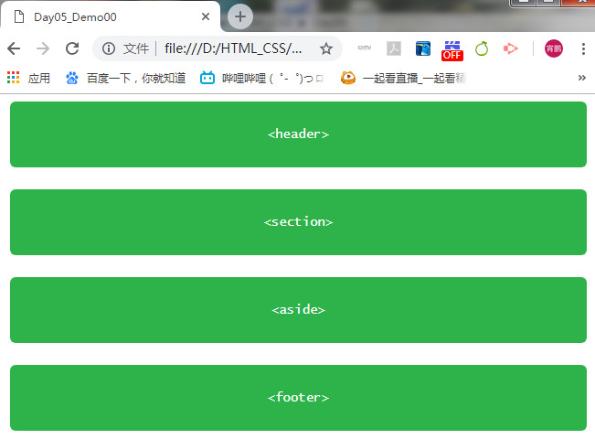
+ Demo01
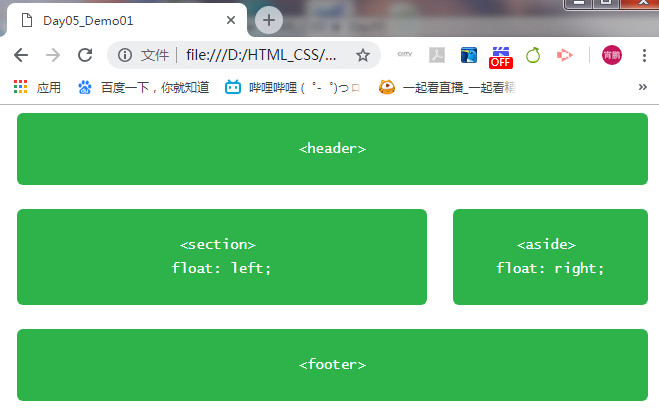
+ Demo02
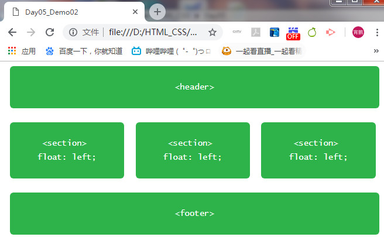
+ Demo03
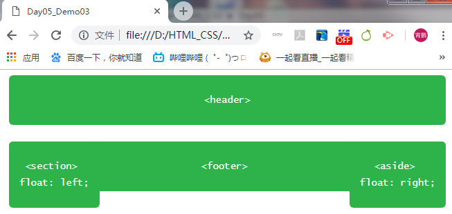
+ Demo04
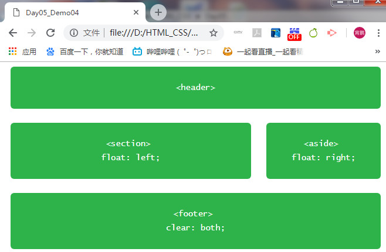
+ Demo05
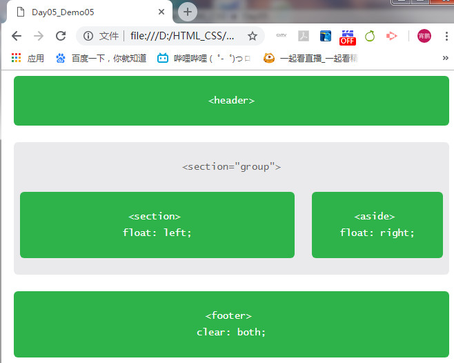
+ Demo06
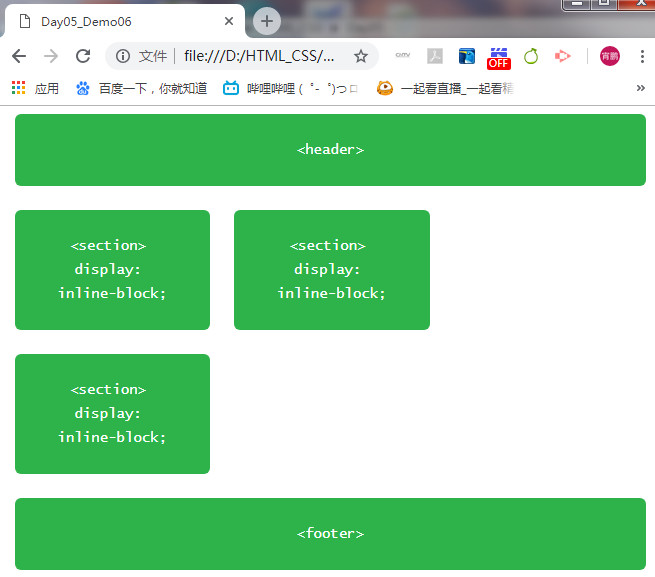
+ Demo07
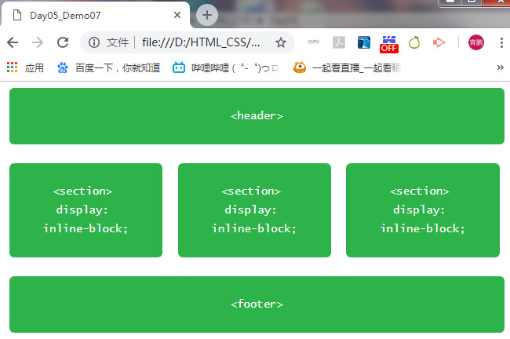
+ Demo08
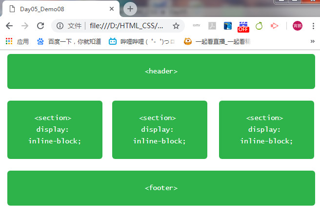
+ Demo09

  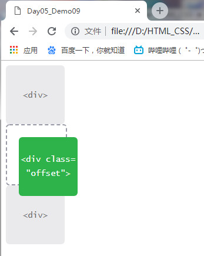
+ Demo10
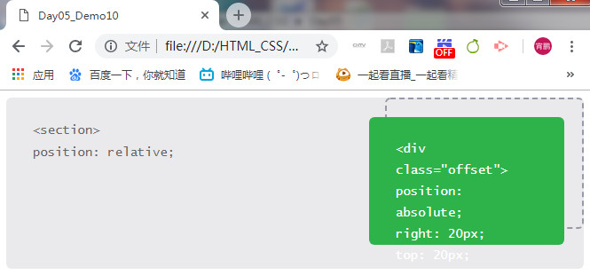
